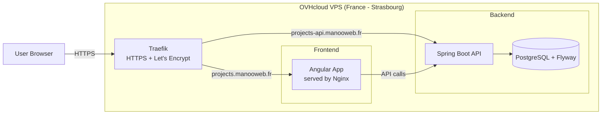

# springboot-rest-api-demo

[](https://github.com/manooweb/springboot-rest-api-demo/actions/workflows/backend.yml)
[](https://github.com/manooweb/springboot-rest-api-demo/actions/workflows/api-e2e-bruno.yml)
[](https://github.com/manooweb/springboot-rest-api-demo/actions/workflows/frontend.yml)
[](https://github.com/manooweb/springboot-rest-api-demo/actions/workflows/sonarqube.yml)
[](https://github.com/manooweb/springboot-rest-api-demo/actions/workflows/deploy-vps.yml)
[](https://github.com/manooweb/springboot-rest-api-demo/blob/main/LICENSE)

---

## 🚀 Overview

**Fullstack demo project** built with a modern Java / Angular stack.

- **Backend**: Spring Boot 3 (Java 21), PostgreSQL, Flyway, Spring Security, JWT
- **Frontend**: Angular 20 + Angular Material (standalone components only)
- **API documentation**: OpenAPI / Swagger
- **API tests**: Bruno (manual + E2E in CI)

---

## 🌐 Live demo (production)

- Frontend: https://projects.manooweb.fr
- API: https://projects-api.manooweb.fr
- Swagger UI: https://projects-api.manooweb.fr/swagger-ui/index.html
- Healthcheck: https://projects-api.manooweb.fr/api/v1/health
- Demo account: `demo / demo`

---

## 📦 Public MVP release

The currently deployed public MVP corresponds to:

- **v0.20.0** — UI i18n-ready foundation

Full release notes:
https://github.com/manooweb/springboot-rest-api-demo/releases/tag/v0.20.0

---

## ⚠️ Known limitations (MVP)

- Swagger UI is publicly accessible (intentional, demo purpose)
- Demo account (`demo / demo`) is shared
- No rate limiting or advanced security hardening yet

---

## 🧭 Backlog

- Project board: https://github.com/users/manooweb/projects/4/views/1

---

## 🏗️ Infrastructure (MVP)

- Hosting: **OVHcloud VPS (France – Strasbourg)**
- Reverse proxy: Traefik (HTTPS via Let's Encrypt)
- Frontend: Angular served via Nginx (Docker)
- Backend: Spring Boot (Docker)
- CI/CD: GitHub Actions (SSH deployment)
- Database: PostgreSQL (Docker)
- Migrations: Flyway




---

## 📁 Repository structure

- `backend/` : Spring Boot REST API
- `frontend/` : Angular application
- `bruno/` : API test collections
- `docker-compose.yml` : PostgreSQL for local dev

---

## ⚙️ Quick start (fullstack)

### Prerequisites

- Java 21
- Node.js + npm
- Docker + Docker Compose

### 1) Start database

    docker compose up -d

### 2) Start backend

    cd backend
    ./mvnw spring-boot:run -Dspring-boot.run.profiles=docker

### 3) Start frontend

    cd frontend
    npm install
    npm run start

> The frontend uses an Angular proxy configuration.

---

## 🛑 Stop services

    docker compose down

Reset data:

    docker compose down -v

---

## 🔗 Useful URLs

### Frontend

- http://localhost:4200

### Backend

- Swagger: http://localhost:8080/swagger-ui.html
- OpenAPI: http://localhost:8080/v3/api-docs

---

## 🔐 Authentication (JWT)

### Backend

- `POST /api/v1/auth/login`
- Protected routes: `/api/v1/**`
- Header: `Authorization: Bearer <token>`

### Frontend

- Login page
- JWT stored client-side
- HTTP interceptor
- Route guard
- Logout clears token

---

## 🧪 API testing (Bruno)

- Collections: `bruno/backend`
- E2E: `bruno/backend/e2e`

Run locally:

    npm install
    npm run test:api

---

## 🧪 Backend tests

    cd backend
    ./mvnw test

---

## 🧪 Frontend tests

    cd frontend
    npm install
    npm test -- --watch=false --browsers=ChromeHeadless

---

## 🔍 Code quality

### Formatting

Java code formatting is enforced using Spotless.

Verify formatting:

```bash
./backend/mvnw verify
```

Fix formatting:

```bash
./backend/mvnw spotless:apply
```

---

## 🧠 Project philosophy

- Angular standalone components only
- Simple forms (intentional)
- Backend = source of truth
- No over-engineering
- Focus on clarity

---

## 🔮 Planned improvements

- UI/UX improvements
- Accessibility
- i18n
- Security hardening
- Performance optimizations
