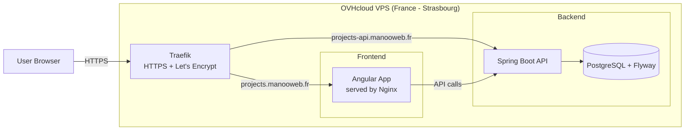

# springboot-rest-api-demo

[](https://github.com/manooweb/springboot-rest-api-demo/actions/workflows/backend.yml)
[](https://github.com/manooweb/springboot-rest-api-demo/actions/workflows/frontend.yml)
[](https://github.com/manooweb/springboot-rest-api-demo/actions/workflows/api-e2e-bruno.yml)
[](https://github.com/manooweb/springboot-rest-api-demo/actions/workflows/backend-sonarqube.yml)
[](https://github.com/manooweb/springboot-rest-api-demo/actions/workflows/frontend-sonarqube.yml)
[](https://github.com/manooweb/springboot-rest-api-demo/actions/workflows/deploy.yml)
[](https://github.com/manooweb/springboot-rest-api-demo/blob/main/LICENSE)

**Backend**

[](https://sonarcloud.io/summary/new_code?id=manooweb_springboot-rest-api-demo-backend)
[](https://sonarcloud.io/summary/new_code?id=manooweb_springboot-rest-api-demo-backend)

**Frontend**

[](https://sonarcloud.io/summary/new_code?id=manooweb_springboot-rest-api-demo-frontend)
[](https://sonarcloud.io/summary/new_code?id=manooweb_springboot-rest-api-demo-frontend)

---

## 🚀 Overview

**Fullstack demo project** built with a modern Java / Angular stack.

- **Backend**: Spring Boot 3 (Java 21), PostgreSQL, Flyway, Spring Security, JWT
- **Frontend**: Angular 20 + Angular Material (standalone components only)
- **API documentation**: OpenAPI / Swagger
- **API tests**: Bruno (manual + E2E in CI)

---

## 🌐 Live demo (production)

- Frontend: https://projects.manooweb.fr
- API: https://projects-api.manooweb.fr
- Swagger UI: https://projects-api.manooweb.fr/swagger-ui/index.html
- Healthcheck: https://projects-api.manooweb.fr/api/v1/health
- Demo account: `demo@example.com / demo`

Additional cloud deployments:

| Platform | Frontend | API |
| --- | --- | --- |
| GCP | https://spring-boot-api-demo-frontend-752012131551.europe-west1.run.app/login | https://springboot-rest-api-demo-752012131551.europe-west1.run.app |

Cloud deployment experience also validated on:

- AWS ECS Fargate
- Azure Container Apps

**Only actively maintained public deployment endpoints are listed above.**

---

## 📦 Public MVP release

The currently deployed public MVP corresponds to:

- **v0.21.0** — JWT cookie authentication and frontend session handling

Full release notes:
https://github.com/manooweb/springboot-rest-api-demo/releases/tag/v0.21.0

---

## ⚠️ Known limitations (MVP)

- Swagger UI is publicly accessible (intentional, demo purpose)
- Demo account (`demo@example.com / demo`) is shared
- No rate limiting or advanced security hardening yet

---

## 🧭 Backlog

- Project board: https://github.com/users/manooweb/projects/4/views/1

---

## 🏗️ Infrastructure (MVP)

- Hosting: **OVHcloud VPS (France – Strasbourg)**
- Reverse proxy: Traefik (HTTPS via Let's Encrypt)
- Frontend: Angular served via Nginx (Docker)
- Backend: Spring Boot (Docker)
- CI/CD: GitHub Actions (SSH deployment)
- Database: PostgreSQL (Docker)
- Migrations: Flyway




---

## 📁 Repository structure

- `backend/` : Spring Boot REST API
- `frontend/` : Angular application
- `bruno/` : API test collections
- `docker-compose.yml` : PostgreSQL for local dev

---

## ⚙️ Quick start (fullstack)

### Prerequisites

- Java 21
- Node.js + npm
- Docker + Docker Compose

### 1) Start database

    docker compose up -d

### 2) Create local backend environment file

Copy the example file and fill in the expected values:

    cp backend/.env.example backend/.env

The backend loads `backend/.env` through Spring Boot config import in local runs.
Deployment environments should provide the same variables directly through the target platform.

### 3) Start backend

    cd backend
    ./mvnw spring-boot:run -Dspring-boot.run.arguments="--spring.profiles.active=dev --server.address=0.0.0.0"

### 4) Start frontend

    cd frontend
    npm install
    npm start

The local frontend runs over HTTPS and proxies `/api` requests to the backend.
For LAN tests, use:

    npm run start:devlan

The backend and frontend listen on `0.0.0.0` so they can be reached from another device on the local network.

---

## 🛑 Stop services

    docker compose down

Reset data:

    docker compose down -v

---

## 🔗 Useful URLs

### Frontend

- https://localhost:4200

### Backend

- Swagger: https://localhost:8443/swagger-ui/index.html
- OpenAPI: https://localhost:8443/v3/api-docs

---

## 🔐 Authentication and JWT flow

Authentication is based on JWTs issued by the Spring Boot backend and transported through
secure cookies.

### Authentication flow

1. The frontend sends credentials to `POST /api/v1/auth/login`.
2. The backend validates credentials with Spring Security.
3. On success, the backend creates a signed JWT and sends it as an `auth_token` cookie.
4. The `auth_token` cookie is configured as `HttpOnly`, `Secure`, and `SameSite=Strict`.
5. The backend also exposes a readable `XSRF-TOKEN` cookie for CSRF protection.
6. The browser automatically sends cookies on same-origin API calls.
7. The frontend does not read, decode, store, or send the JWT manually.
8. Protected backend routes validate the JWT extracted from the `auth_token` cookie.
9. After a page refresh, the frontend restores its session state with `GET /api/v1/me`.
10. On logout, the frontend calls `POST /api/v1/auth/logout`, and the backend clears both auth and CSRF cookies.

### Security choices and tradeoffs

- JWTs are not stored in `localStorage` or `sessionStorage` to reduce the impact of XSS.
- The JWT cookie is `HttpOnly`, so frontend JavaScript cannot access the token value.
- The JWT cookie is `Secure`, so HTTPS is required in production and local development.
- Cookie-based authentication requires CSRF protection because browsers send cookies automatically.
- CSRF protection uses a readable `XSRF-TOKEN` cookie and an `X-XSRF-TOKEN` request header.
- Swagger UI uses the same cookie + CSRF flow as production instead of a manual Bearer token input.
- The frontend uses relative `/api/...` URLs. Local development uses the Angular proxy, and deployed frontend containers use Nginx with `BACKEND_ORIGIN` environment variable.
- JWT expiration is enforced by the backend. The frontend detects expired sessions from `401` responses and redirects to login with an explicit message.
- JWT TTL is configurable with `APP_SECURITY_JWT_TTL_SECONDS` environment variable and defaults to `3600` seconds.

### Current limitations

- There is no refresh token yet.
- There is no server-side JWT revocation list yet.
- Logging out clears browser cookies but does not invalidate already issued JWTs server-side before their expiration.
- The demo user is still in-memory and intended for demonstration purposes only.

---

## 🧪 API testing (Bruno)

- Collections: `bruno/backend`
- E2E: `bruno/backend/e2e`

Run locally:

    npm install
    npm run test:api

---

## 🧪 Backend tests

    cd backend
    ./mvnw test

---

## 🧪 Frontend tests

    cd frontend
    npm install
    npm test -- --watch=false --browsers=ChromeHeadless

---

## 🔍 Code quality

### SonarQube / SonarCloud

Sonar analysis for both backend and frontend is run only in CI via GitHub Actions and SonarCloud.

- Backend analysis: `.github/workflows/backend-sonarqube.yml`
- Frontend analysis: `.github/workflows/frontend-sonarqube.yml`

For local checks before push, use:

- backend: `cd backend && ./mvnw clean verify`
- frontend: `cd frontend && npm run qa`

### Formatting

#### Backend

Java code formatting is enforced using Spotless.

Verify formatting:

```bash
./backend/mvnw -f backend spotless:check
```

Fix formatting:

```bash
./backend/mvnw -f backend spotless:apply
```

#### Frontend

Frontend code formatting is enforced using prettier. Additional code quality rules are checked with ESLint.

Verify formatting and code quality rules:

```bash
cd frontend
npm run format:check && npm run lint
```

Fix formatting:

```bash
npm run format
```

---

## 🧠 Project philosophy

- Angular standalone components only
- Simple forms (intentional)
- Backend = source of truth
- No over-engineering
- Focus on clarity

---

## 🔮 Planned improvements

- UI/UX improvements
- Accessibility
- i18n
- Security hardening
- Performance optimizations
